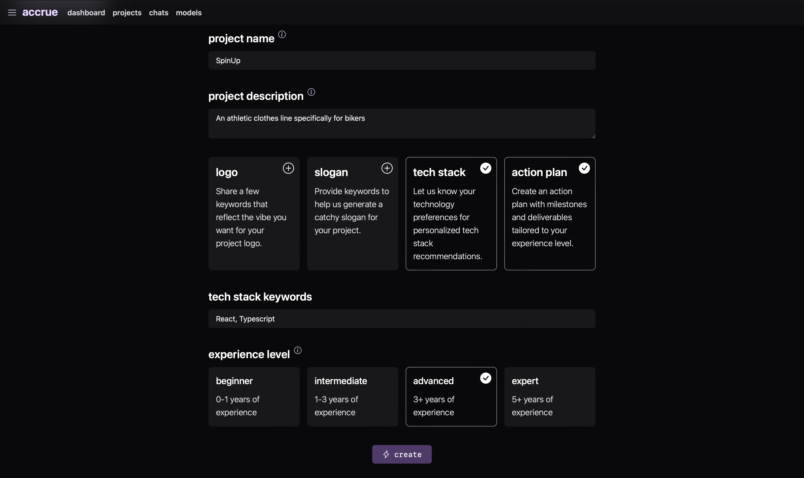

# Accrue

A flexible front-end for OpenAI-compatible APIs like Ollama, llama.cpp, LM Studio, and more.

Accrue is a project meant to showcase the React, NextJS, and Supabase stack. For a similar but *much* more batteries-included project, check out [Open WebUI](https://github.com/open-webui/open-webui) or [Chatbot UI](https://github.com/mckaywrigley/chatbot-ui).

## Purpose

Accrue is meant to help with project management - it's a place where users can get suggestions on questions they ask about their project, and store those questions and answers for later reference. It's a simple, but useful, tool for anyone working on a project.

## Features

- Performant, server-side-rendered React app
- Allows multiple backends - Ollama, llama.cpp, LM Studio, OpenAI API, etc.
- User authentication and data storage with Supabase